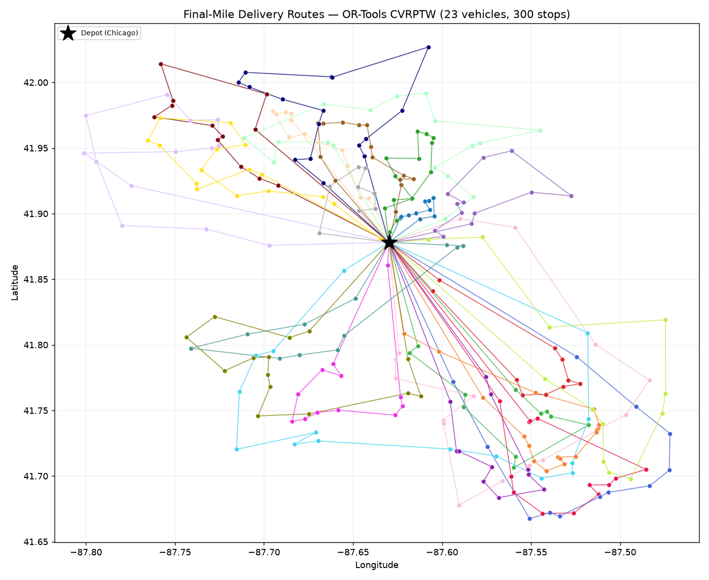

# Final-Mile Transportation Route Optimization

Optimizing a day of pharmacy deliveries: 300 stops, one depot, delivery
time windows, and vehicle capacity limits — solved as a **capacitated
vehicle routing problem with time windows (CVRPTW)** using Google
OR-Tools, and benchmarked against the nearest-neighbor greedy heuristic
that manual dispatch typically resembles.



## Results (from the run in `outputs/`)

| Metric                  | Nearest-neighbor baseline | OR-Tools CVRPTW | Change        |
|-------------------------|--------------------------:|----------------:|--------------:|
| Total route miles       |                     789.6 |           582.6 | **−26.2%**    |
| Vehicles used           |                        23 |              23 | 0             |
| Stops served / dropped  |                 300 / 0   |         300 / 0 | —             |
| Avg stops per route     |                      13.0 |            13.0 | —             |

- All 300 stops served within their delivery windows; no stops dropped.
- Optimization cut **207 route miles (−26.2%)** versus greedy dispatch.
- Fleet size is unchanged because 23 vehicles is the capacity lower bound
  for this demand (1,325 packages ÷ 60 per van ≈ 22.1); both methods reach
  it, so the savings show up as miles, driver hours, and fuel rather than
  vehicles. (In the real operation this mirrors: same fleet, shorter days.)
- Solve time: ~45 s for the OR-Tools run (configured limit); the full
  pipeline runs in about a minute.

## Methodology

**Problem.** Each day, one depot (downtown Chicago) must serve 300 pharmacy
delivery stops. Each stop needs 1–8 packages, takes 3–6 minutes to service,
and has a 1.5–3 h delivery window inside an 08:00–17:00 working day. Vans
carry 60 packages. Routes must respect both capacity and time windows.

**Optimized model (OR-Tools RoutingModel).**
- **Cost:** haversine (great-circle) distance in meters.
- **Capacity dimension:** cumulative packages per vehicle ≤ 60.
- **Time dimension:** travel time = distance ÷ ~30 mph average urban speed,
  plus service time at each stop; per-stop window constraints; depot window
  spanning the working day; waiting allowed, so vehicles may arrive early.
- **Robustness:** stops carry a large drop penalty, so the solver returns
  the best feasible plan (and reports any drop) instead of failing.
- **Search:** `PATH_CHEAPEST_ARC` first solution, then
  `GUIDED_LOCAL_SEARCH` metaheuristic with a 45-second limit.

**Baseline.** Nearest-neighbor greedy: from the depot, always drive to the
nearest unvisited stop that still fits the van and can be reached before
its window closes; start a new vehicle when neither works. This is a fair
stand-in for manual/greedy dispatch and serves all 300 stops.

**Evaluation.** Total route miles (haversine, depot out-and-back), vehicles
used, stops served, and stops per route for both methods;
`outputs/comparison_summary.json` has the full numbers and
`outputs/routes.csv` the optimized stop-by-stop plan with arrival times.

## Tech stack

Python 3.12 · Google OR-Tools 9.15 (routing solver) · NumPy / pandas
(data + distance matrices) · matplotlib (route map)

## How to run

```bash
python3 -m venv .venv
.venv/bin/pip install -r requirements.txt
.venv/bin/python src/main.py            # ~1 minute end to end
.venv/bin/python src/main.py --time-limit 60   # give the solver longer
```

`src/main.py` generates the dataset if missing, solves, benchmarks, and
writes everything under `outputs/`.

## Project layout

```
data/deliveries.csv       synthetic stops (seeded, reproducible)
src/generate_data.py      dataset generator (seed 42)
src/routing_utils.py      haversine distances, travel time, miles
src/solver.py             OR-Tools CVRPTW model + guided local search
src/baseline.py           nearest-neighbor greedy baseline
src/main.py               orchestration, metrics, outputs, map
outputs/                  routes.csv, comparison_summary.{json,csv}, route_map.png
```

## Honest limitations

- **Data is synthetic.** Coordinates, demand, service times, and windows
  are generated with a seeded RNG around the Chicago metro area — no real
  customer or operational data. The pipeline is the contribution; point
  `data/deliveries.csv` at real stops and it runs unchanged.
- **Distances are straight-line (haversine),** not road-network distances,
  so absolute miles are approximations; the *relative* improvement vs. the
  baseline is the meaningful figure.
- Travel speed is a single average (~30 mph); no traffic, one-way streets,
  or stop clustering beyond the synthetic clusters.
- OR-Tools runs to a time limit, so solutions are near-optimal, not proven
  optimal.
